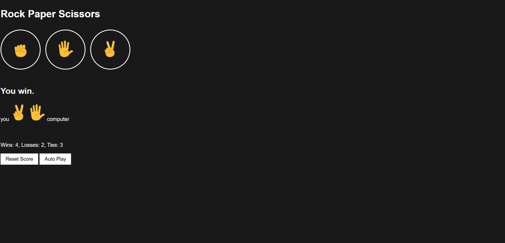

# 🎯 Rock Paper Scissors Game

A fun and interactive **Rock-Paper-Scissors** game built with HTML, CSS, and JavaScript.

---

## 📂 Project Table

| Title               | Code                                                                 | Live Demo |
|---------------------|----------------------------------------------------------------------|-----------|
| Rock Paper Scissors | [View Code](https://github.com/rohini19-coder/Rock-Paper-Scissor) | [Play Game](https://rohini19-coder.github.io/Rock-Paper-Scissor/) |

---

## 📸 Preview

---

## 📜 Features
- Choose Rock, Paper, or Scissors to play against the computer  
- Keeps track of Wins, Losses, and Ties  
- Auto Play mode  
- Score persists after refresh using `localStorage`  
- Minimal, responsive design

---

## 🛠 Technologies Used
- **HTML5**
- **CSS3**
- **JavaScript**

---
